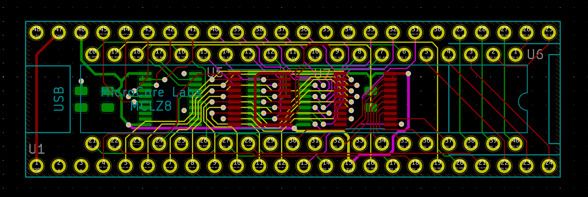
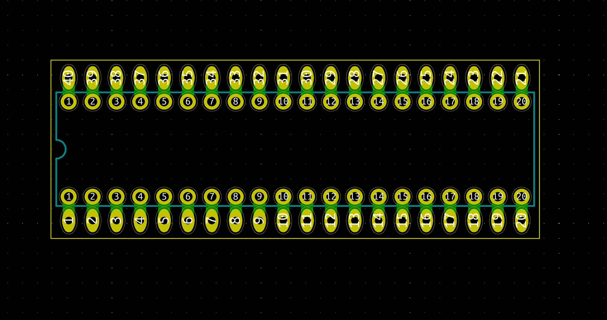

# MCLZ8-small-board
A small interface board between a Teensy 4.1 and a Z80 socket to run MCLZ8 code

Two boards are presented - MCLZ8_PCB fits in the same footprint as The Teensy 4.1 and performs the functionality of @MicroCoreLabs MCLZ8 board, in providing the bus buffering for the Teensy. The Schematic is unchanged from @MicroCoreLabs MCLZ8. The 40 pin probing adapter B board goes underneath, and simply adapts the 40 pin header from the first board back to 0.6" hole centers, so we can plug it into a Z80 socket.

